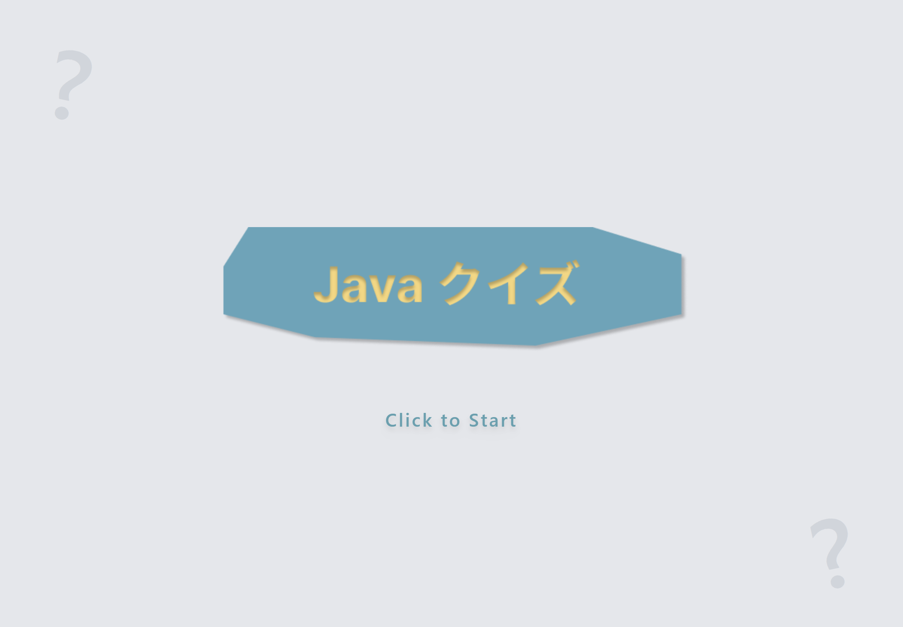
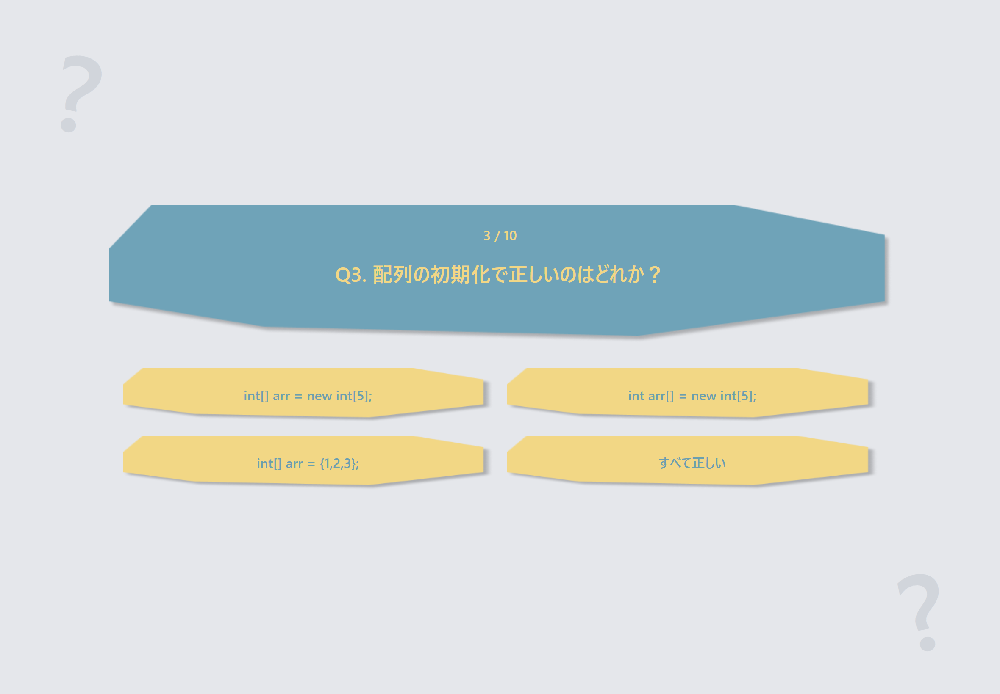
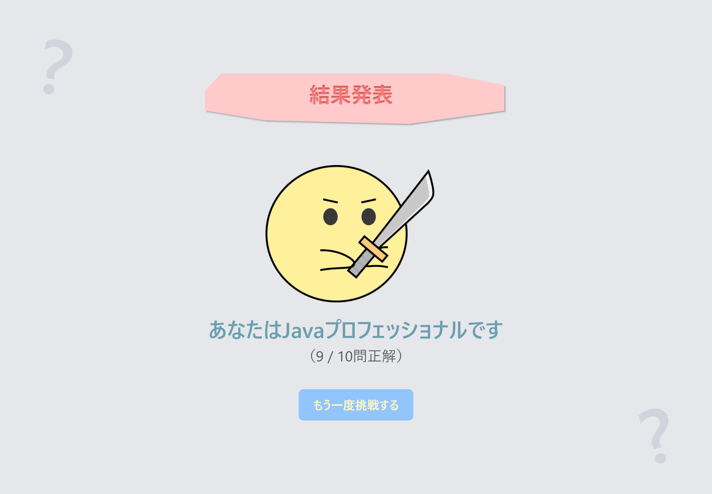

# app01_quiz

Java Silver の学習を目的に作成した 4 択クイズアプリです。
Java で問題データを生成し、JavaScript で画面表示とクイズ進行を行います。

## 1. このリポジトリで AI が担当した範囲

このアプリは学習プロジェクトとして、人間の実装に対して AI がレビューと補助実装を行いました。

- 要件整理、設計レビュー、実装レビュー、テストレビューの支援
- バグ修正提案と一部コード修正（イベント処理、JSON 出力、テストコード）
- 実行手順の整理と README/成果物ドキュメント更新
- 画面演出の追加支援（正解時の紙吹雪エフェクト）

最終的な動作確認と学習内容の判断は作成者本人が実施しています。

## 2. ディレクトリ構成

```text
app01_quiz/
├── src/main/java/quiz/
│   ├── Main.java
│   ├── Question.java
│   └── QuizExporter.java
├── src/test/java/quiz/
│   └── QuizExporterTest.java
├── web/
│   ├── index.html
│   ├── app.js
│   └── questions.json
├── images/
└── 成果物/
```

## 3. 実行環境

- OS: Windows（PowerShell 5.1 で確認）
- Java: JDK 11 相当
- 文字コード: UTF-8（`javac -encoding UTF-8` を必ず指定）

## 4. 実行手順

### 4-1. questions.json の生成

```powershell
cd "c:\Users\utapi\Documents\10_study\20260313_JavaStudy\app01_quiz"
javac -encoding UTF-8 src/main/java/quiz/Question.java src/main/java/quiz/QuizExporter.java src/main/java/quiz/Main.java -d out
java -cp out Main
```

補足:

- `Main` は実行ディレクトリを見て出力先を解決します。
- 通常は `app01_quiz` 配下で実行し、`web/questions.json` を更新してください。

### 4-2. 画面起動

`web/index.html` をブラウザで開くとクイズを実行できます。

## 5. テスト手順

```powershell
cd "c:\Users\utapi\Documents\10_study\20260313_JavaStudy\app01_quiz"
javac -encoding UTF-8 src/main/java/quiz/Question.java src/main/java/quiz/QuizExporter.java src/test/java/quiz/QuizExporterTest.java -d out
java -cp out QuizExporterTest
```

想定される結果例:

- `PASS: testQuestionGetters_text`
- `PASS: testExportQuestions`
- `PASS: testExportThreeQuestions`
- `PASS: testExportEmpty`
- `PASS: testEscapeDoubleQuote`

## 6. スクリーンショット






